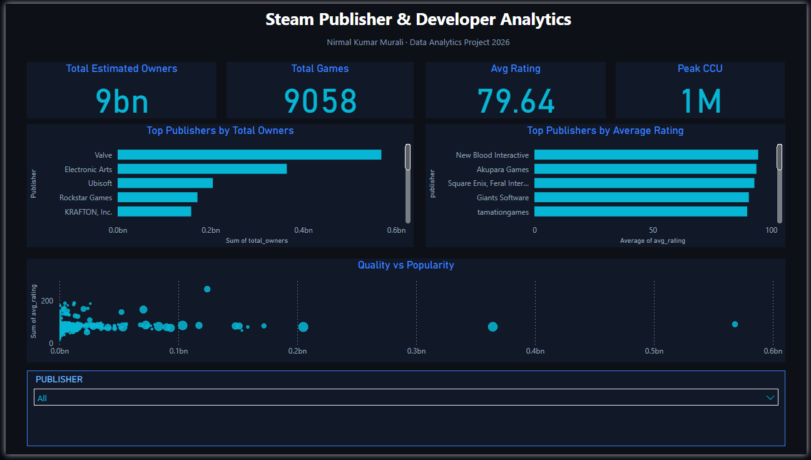

# Steam Games Publisher & Developer Analytics

**Nirmal Kumar Murali**

> Analysis of 10,000+ Steam games to identify which publishers and developers have the most successful portfolios — using Python, SQL, and Power BI.

---

## 📊 Dashboard Preview



*Interactive Power BI dashboard — dark theme with KPI cards, publisher rankings, quality-vs-popularity scatter analysis, and dynamic publisher slicer.*

---

## 🗂 Project Structure

```
steam-publisher-analytics/
├── steam_analysis.ipynb      ← Python analysis notebook (Pandas)
├── steam_queries.sql         ← SQL queries for the same dataset
├── steam_dashboard.pbix      ← Power BI interactive dashboard
├── steam_games_dataset.csv   ← Raw dataset (10,000+ games)
├── dashboard_screenshot.png  ← Dashboard preview
├── README.md
├── LICENSE
└── .gitignore
```

---

## 🎯 Key Questions Answered

1. Which publishers have the most estimated game owners overall?
2. Which publishers make the most consistently loved games?
3. Which developers generate the most total reviews?
4. Which free games are both massively played AND highly rated?
5. What does the price distribution look like across publisher catalogs?

---

## 🔍 Key Findings

- **Biggest publisher by estimated owners:** Valve (150M+ for CS:GO alone)
- **Most consistently loved publisher:** Red Barrels (93.7% avg rating across 3+ games)
- **Most loved single game:** Portal 2 — 98.7% positive reviews across 430K+ reviewers
- **Scale ≠ Quality:** Valve does NOT appear in the top 10 most loved publishers — smaller studios like Fireproof Games consistently outperform them on quality metrics
- **Elite free games:** Only a small group of free games maintain CCU > 10,000 AND rating > 80% simultaneously

---

## 🛠 Skills Demonstrated

### Layer 1 — Python (Pandas)
- Loading and exploring real-world CSV data (10,000+ rows, 17 columns)
- Handling missing values with `isnull().sum()`
- Cleaning messy string data — parsing `"1,000,000 .. 2,000,000"` into numeric midpoints using a custom function
- Creating calculated columns: positive ratio, price in EUR, playtime in hours
- Filtering for statistical reliability (min 100 reviews)
- Aggregating publisher portfolios with `groupby().agg()` across 6 KPIs simultaneously
- Sorting and ranking publisher/developer portfolios

### Layer 2 — SQL (SQLite)
- `SELECT`, `FROM`, `WHERE`, `ORDER BY`, `LIMIT`
- `GROUP BY` with `COUNT()`, `AVG()`, `SUM()`, `MAX()`
- `HAVING` to filter aggregated groups
- Calculated fields inside queries
- Multi-condition filtering combining `WHERE` and `HAVING`
- Replicating all Pandas findings in SQL to validate results

### Layer 3 — Power BI Dashboard
- Importing cleaned CSV data into Power BI
- Building 4 KPI cards: Total Owners, Total Games, Avg Rating, Peak CCU
- Creating Top 15 Publishers bar chart (by total owners)
- Creating Top Publishers by Average Rating bar chart
- Building a Quality vs Popularity scatter chart (size = game count)
- Adding a dynamic Publisher dropdown slicer for interactive filtering
- Applying dark theme with custom colors for professional presentation
- DAX measures for aggregated metrics

---

## 📈 Dashboard Features

| Visual | Description |
|--------|-------------|
| 4 KPI Cards | Total Owners · Total Games · Avg Rating · Peak CCU |
| Bar Chart 1 | Top 15 publishers by estimated total owners |
| Bar Chart 2 | Top publishers by average review rating |
| Scatter Plot | Quality vs Popularity — bubble size = game count |
| Slicer | Dynamic publisher filter — affects all visuals |

---

## 🚀 How to Run

### Python Analysis
```bash
pip install pandas numpy jupyter
jupyter notebook
```
Open `steam_analysis.ipynb` and run all cells top to bottom.
The notebook exports `publisher_stats.csv` and `steam_cleaned.csv`.

### SQL Analysis
1. Go to [sqliteonline.com](https://sqliteonline.com)
2. Import `steam_games_dataset.csv` (tick "First row is header")
3. Open `steam_queries.sql` and run any query

### Power BI Dashboard
1. Open `steam_dashboard.pbix` in Power BI Desktop
2. Use the Publisher slicer to filter all visuals dynamically
3. Hover over scatter plot bubbles to see publisher details

---

## 📦 Dataset

- **Source:** [Kaggle — Steam Games Dataset](https://www.kaggle.com/datasets)
- **License:** CC0 Public Domain
- **Size:** ~10,000 games, 17 columns

---

## 💡 Key Takeaways

- Messy real-world data requires thoughtful preparation — the `owners` column was stored as a string range and needed a custom parsing function to extract usable numeric values
- Statistical reliability matters — filtering out games with fewer than 100 reviews prevents misleading percentage calculations
- `GROUP BY` in SQL and `groupby().agg()` in Pandas solve the same analytical problem with different syntax — knowing both gives flexibility across environments
- Scale does not equal quality — boutique studios consistently outperform industry giants on average review sentiment by up to 15%

---

## 👤 Author

**Nirmal Kumar Murali**
MSc Data Science & Analytics — EPITA Paris
[LinkedIn](https://www.linkedin.com/in/nirmal-kumar-murali/) · [GitHub](https://github.com/nirmalkumarmurali) · [Portfolio](https://nirmalkumarmurali.github.io/portfolio)
